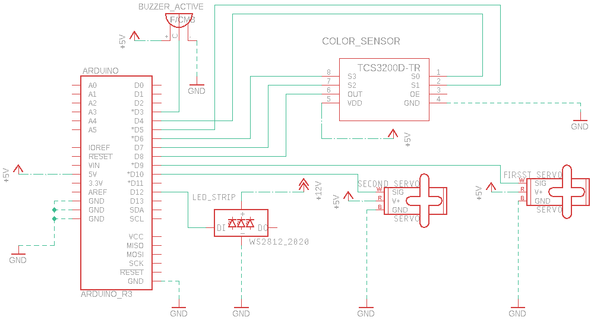

# Packing-Pipe

## Introduction 
The aim of this project is to give an insight to what an ARDUINO-based project is and the different ways each component interracts with the microcontroller. The Packing Pipe sorts and groups the objects based on color. The machine will produce an error signal each time a residue is found in the pipe, removing it from the pile of objects

## Description
In order to design and build the machine, I had 3 core elements in mind:
*  **Object movement** is done by two **Servomotors**. The two servomotors acts on two circular plates, alligned on a central vertical axis. The upper servomotor transports one object from the starting point to the color-detecting position and then to the eviciton hole, while the lower servomotor makes sure the object falls into the right collection of objects
* **Color recognition** is done by the **TCS3200 Color Sensor**. This sensor is set to identify red, blue, green, yellow. All objets that don't have any of the colors mentioned earlier will be considered as residue and will be removed. 
*  **User Feedback** is done by two components: An **Addressable LED Strip** which changes its color based on the color identified by the TCS3200 sensor and an **Buzzer** tha will produce an error signal when a residue is found

## Block Design

## Hardware Design

## Software Design

The software design revolves around the idea of a finite state machine. As a result, I designed 6 different states in which an object can be found during the entire process. The transition between each state is done at regular intervals of time.

To achieve this, we used **TIMER 2**. At equal intervals, through the interrupt TIMER2_COMPA, the transition from one state to another is made. I used TIMER2, as TIMER0 is used for the LED address band, and TIMER1 is needed to move the actuators. Since the estimated time required to switch from one state to another is about 4 seconds, obtaining a frequency that is much too low for TIMER2, I had to use a volatile timer_count variable, which will be incremented at the interrupt level and will make it possible to obtain a frequency. smaller for TIMER2.

The current state will be state in a global variable called *state*. All the 6 possible are:

1. ***START_STATE***: initialization state, the actuators are brought to their START positions.
2. ***POSITION_TO_SENSOR_STATE***: state in which the servomotor controlling the upper plate brings the object from the starting position to the place where the color of the object will be scanned.
3. **SENSOR_STATE**: state in which the color of the object is scanned and the color is determined. The LED strip will be colored according to the identified color, if the object conforms. If the object is non-compliant, an audible error signal will signal the appearance of a scrap, which will be thrown in the scrap container.
4. **POSITION_COLOR_PACK_STATE**: state in which the servomotor corresponding to the lower plate positions the collection of objects corresponding to the color identified under the outlet of the object from the upper level to the lower level.
5. **POSITION_OBJECT_FINAL_STATE**: state in which the servomotor afferent to the upper plate brings the object into the transition mouth between the two levels.
6. **FINAL_STATE**: the object reaches the set corresponding to the identified color; the turntables retract to the initial position.

Funcții implementate
* **setUpTimer** - initialises TIMER2 in CTC mode, with 1024 prescaler, while activating the TIMER2_COMPA interrupt.
* **setUpSensor** - sets the pins used by the corresponding TCS3200 color sensor, while setting the frequency scaling to 20% (recommended value for ARDUINO).
* **setup** - initializes all the components that will be used by the packing tape. The function configures the buzzer, configures the servomotors, initializes the addressable LED strip, initializes the TCS3200 and TIMER2 color sensor.
* **colorLedStrip** - commands the LED strip to color in a given color. The LED strip will light each LED in turn, giving the impression of flow.
* **colorLedStripWithRecognisedColor** - colors the LED strip according to the color recognized by the color sensor.
* **readRedFrequency**, **readGreenFrequency**, **readBlueFrequency** - commands the sensor to read and returns the frequency values ​​of the three color components (red, green, blue).
* **readColor** - performs color scanning using the TCS3200 color sensor (calling readRedFrequency, readGreenFrequency, readBlueFrequency) and recognize the corresponding color. To correctly determine the color, the 3 values ​​of the frequency of the components are compared with some standard values. In order to determine the standard values ​​corresponding to my sensor, I had to follow a configuration and adjustment process, in which I made 50 readings for each color and transmitted them on the USART Serial Interface to the Serial Monitor present in the Arduino IDE, saving them in reference files. By processing the data in these files, I determined the standard values ​​specific to my sensor.
* **buzzer_beep** - commands the buzzer to give the audible error signal
* **rotateFirstServoMotor**, **rotateSecondServoMotor** - controls the continuous and cursive movement of the specific servomotor from the initial position to the final position.
* **loop** - the main function of the program, in which, depending on the state we are in, we perform the corresponding actions.

